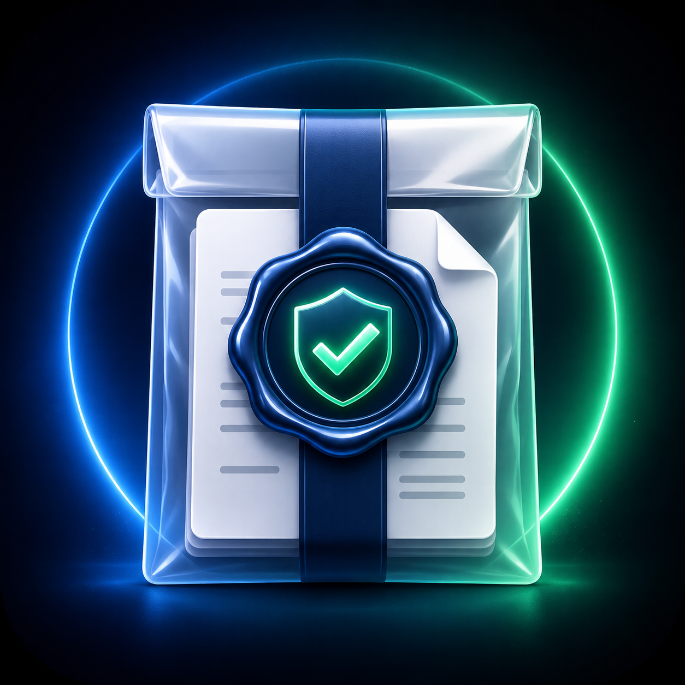

<p align="center"></p>

# EvidencePack

[](https://github.com/kyal102/evidencepack/actions/workflows/ci.yml)   

**Reproducible receipts for claim checks.** Seal *what was checked, by which tool, with what verdict* into a hash-stamped JSON you can verify and diff later.

```bash
python -m evidencepack seal --tool unitgate --input "E = m * a" --status DIMENSIONALLY_INVALID
python -m evidencepack verify pack.json
python -m evidencepack diff pack_a.json pack_b.json
python -m evidencepack --demo
```

Two deterministic hashes:
- **certificate_hash** — fingerprint of the *verified result* (tool, version, normalized input, status, result body). The **timestamp is not part of it**, so the same check sealed twice yields the same certificate.
- **evidence_pack_hash** — fingerprint of the whole pack.

`verify` re-derives both and reports `SEALED_OK` / `CERTIFICATE_MISMATCH` / `PACK_HASH_MISMATCH`. `diff` reports `MATCH` or `DRIFT` with the changed fields.

## Pack fields
`pack_id, schema_version, timestamp, tool_name, tool_version, raw_input, normalized_input, status, result_body, certificate_hash, evidence_pack_hash, replay_command, limitations, next_required_validation, public_wording`

## What it is — and isn't
> EvidencePack records what was checked and whether it can be reproduced. It does not prove scientific truth or replace experiment, simulation or peer review.

See [docs/EXAMPLES.md](docs/EXAMPLES.md) · [docs/LIMITATIONS.md](docs/LIMITATIONS.md). No dependencies (pure stdlib).

## Ecosystem
Part of the public **ClaimGate** verification-tool ecosystem: ClaimGate · ClaimLint · UnitGate · **EvidencePack** · ReplayGate · ClaimStack Demo. These are public lite tools; the full private engine and advanced mechanics remain private.

**AI proposes. Gates verify. Evidence records. Replay checks drift.**
